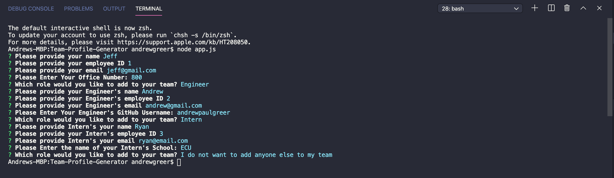
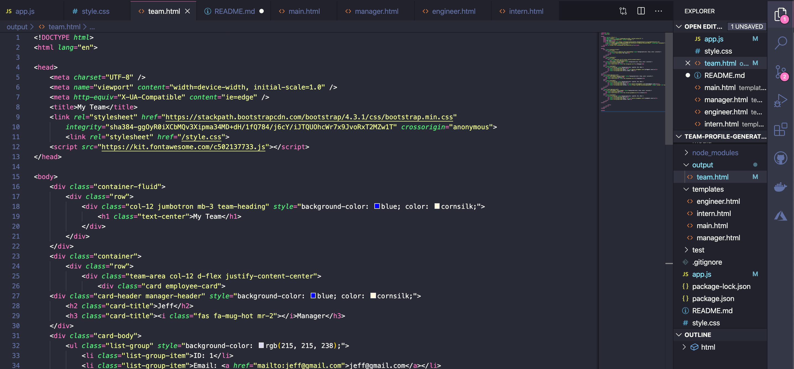
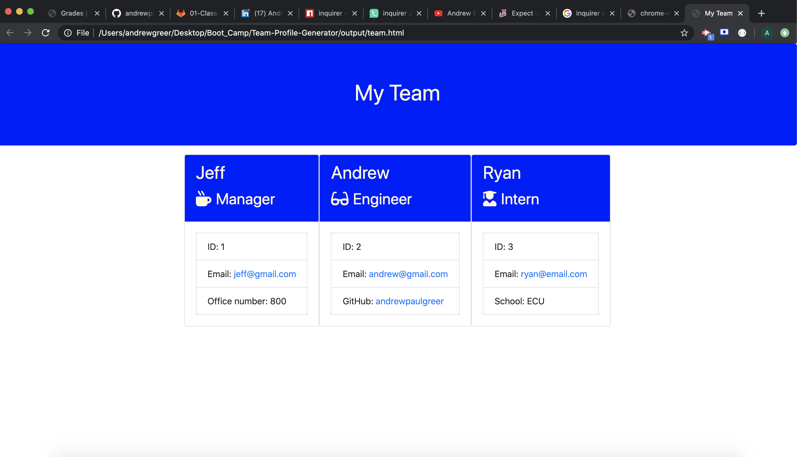
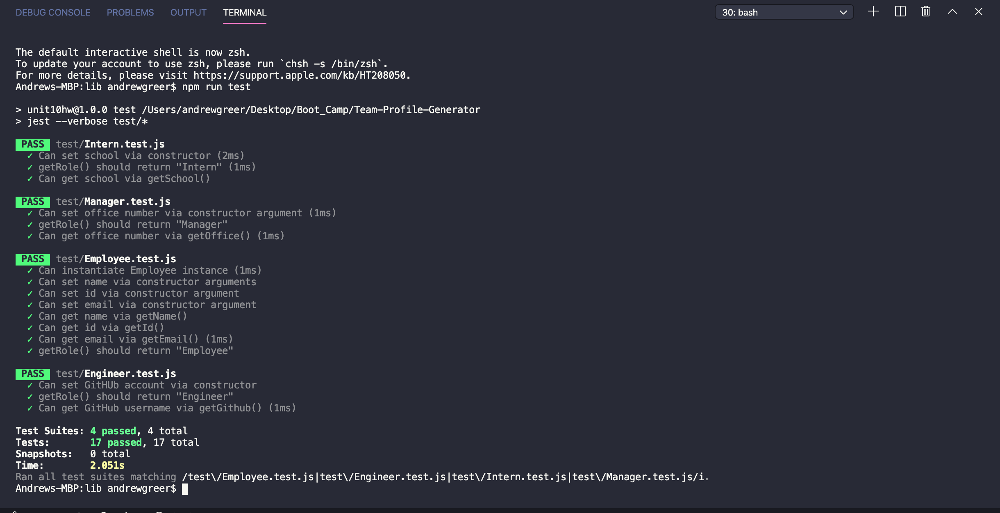

# Team Profile Generator

## Description

This is the README for the team profile generator. This project utilizes Jest for automated testing on classes/ subclasses. Once all tests were passed, I wrote inquirer prompts. In these prompts you will act as the manager, and will add both Engineers and Interns to your team.Once you add memebers to your team by the criteria: name, id, email, office phone number(manager only), github profile (engineers only), and school (intern's only). I also utilized the inquiere package's validate method to restrict user input.

## Table of Contents

- [Installation](#installation)
- [License](#license)
- [Usage](#usage)
- [Contributing](#contributing)
- [Tests](#tests)
- [Questions](#questions)

## Installation

run NPM i

## License

## Usage

YouTube Demonstration Link: https://www.youtube.com/watch?v=hcyoMwyOByg

Answering questions from prompt, acting as the manager

Generated HTML after answering prompts

Here is an example of what will be displayed in the browser

Here is a view of all of the passed tests

## Contributing

Andrew Greer

## Tests

run NPM i, and ask questions for this applicaiotn

## Questions

Email: andrewgreer2015@gmail.com

Github: andrewpaulgreer
